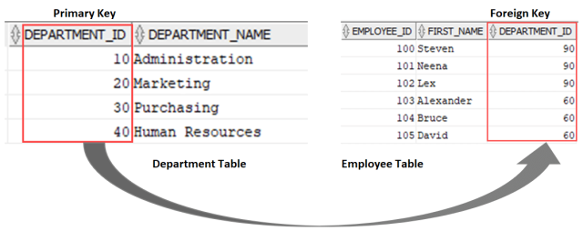

# Data Bases relationships in spring

In the context of databases, a relationship refers to the way two or more database tables are connected or associated
with each other. Relationships are established between tables using keys, specifically primary keys and foreign keys.

* Primary key
* Foreign key
* Cascading
* Fetch types
* Orphan records
* One to One relationship
* One to Many relationship
* Many to Many relationship
* Referential integrity

### **_Primary key_:**

Primary key is key use to uniquely a row in a table.

### **_Foreign key:_**

Foreign key is key use to link two table together, when a primary key of one table is use
in another table, it is known as a foreign key

### **_Cascading:_**

Cascading means propagating an operation from the owning entity to the related entity. When a record in the owning
entity (parent table) is saved, updated or deleted, the change should be reflected in the related entity (child table)
as well.

JPA offers different cascading types which are shown in the table below:

* CascadeType.PERSIST: With this type, the persist operation on the owning entity will be cascaded to the associated
  entities. It ensures that when the owning entity is persisted, the associated entities are also persisted.

* CascadeType.MERGE: This type cascades the merge operation from the owning entity to the associated entities. It
  ensures that when the owning entity is merged, any changes made to the associated entities are also merged.

* CascadeType.REMOVE: With this type, the remove operation on the owning entity will be cascaded to the associated
  entities. It ensures that when the owning entity is removed, the associated entities are also removed.
* CascadeType.REFRESH: This type cascades the refresh operation from the owning entity to the associated entities. It
  ensures that when the owning entity is refreshed, the associated entities are also refreshed, effectively
  synchronizing their state with the database.
* CascadeType.ALL: all of cascading type.

### **_Fetch types_**

### **_One to One relationship_**

One-to-One (1:1) Relationship: In this type of relationship, one record in a table is associated with only one record in
another table. For example, a person's identification number may be linked to their passport details, where each person
has a unique passport.

